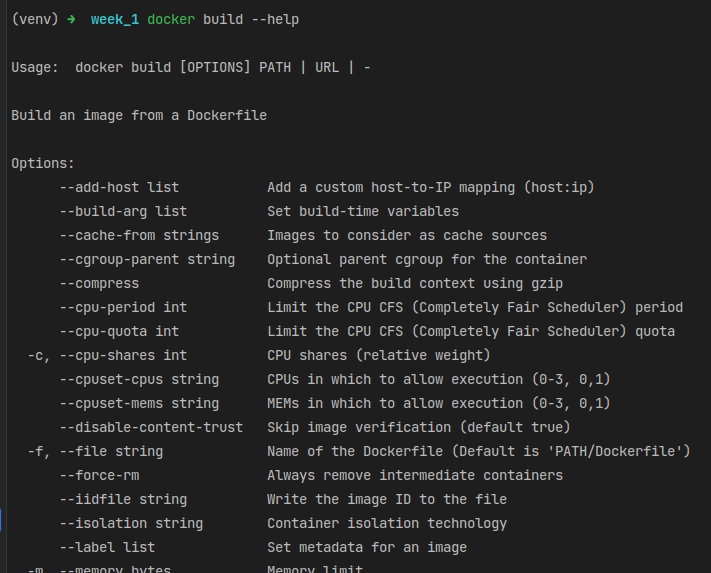
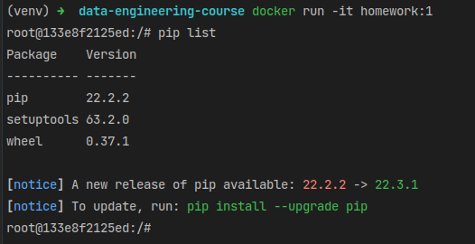
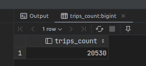
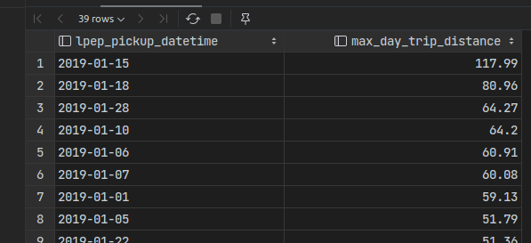
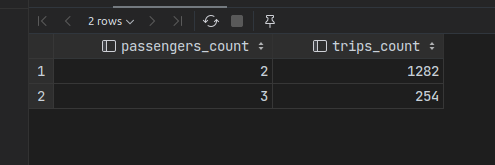
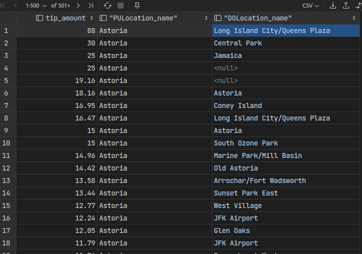

# Answers for [homework (week 1)](https://github.com/DataTalksClub/data-engineering-zoomcamp/blob/main/cohorts/2023/week_1_docker_sql/homework.md)

## Question 1. Knowing docker tags

**Answer**: `--iidfile string`

**Result**:




## Question 2. Understanding docker first run

**Answer**: `3`

**Result**:




## Question 3. Count records

**Answer**: `20530`

**Qwery**:

```sql
select
    count(*) as "trips_count"
from "ny_taxi"."public"."green_taxi_trips"
where "lpep_pickup_datetime"::date = '2019-01-15'
  and "lpep_dropoff_datetime"::date = '2019-01-15';
```

**Result**:



## Question 4. Largest trip for each day

**Answer**: `2019-01-15`

**Qwery**:

```sql
select
    "lpep_pickup_datetime"::date,
    max("trip_distance") as "max_day_trip_distance"
from "ny_taxi"."public"."green_taxi_trips"
group by "lpep_pickup_datetime"::date
order by "max_day_trip_distance" desc;
```

**Result**



## Question 5. The number of passengers

**Answer**: `2: 1282 ; 3: 254`

**Qwery**:

```sql
select
    2 as "passengers_count",
    count(*) as "trips_count"
from "ny_taxi"."public"."green_taxi_trips"
where "lpep_pickup_datetime"::date = '2019-01-01'
  and "passenger_count" = 2
union
select
    3 as "passengers_count",
    count(*) as "trips_count"
from "ny_taxi"."public"."green_taxi_trips"
where "lpep_pickup_datetime"::date = '2019-01-01'
  and "passenger_count" = 3;
```

**Result**



## Question 6. Largest tip

**Answer**: `Long Island City/Queens Plaza`

```sql
select
    gt."tip_amount" as "tip_amount",
    tz_pu."Zone" as "PULocation_name",
    tz_do."Zone" as "DOLocation_name"
from "ny_taxi"."public"."green_taxi_trips" as gt
inner join "ny_taxi"."public"."taxi_zones" as tz_do on gt."DOLocationID" = tz_do."LocationID"
inner join "ny_taxi"."public"."taxi_zones" as tz_pu on gt."PULocationID" = tz_pu."LocationID"
where tz_pu."Zone" = 'Astoria'
order by gt."tip_amount" desc;
```

**Result**


